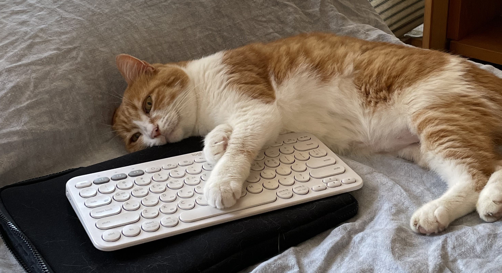

# Pat a Cat | First project
Pat a Cat is a game to give cats love by petting. You can use keyboard arrows instead of hands🙌 and can get score too!

**My Flatmate's cat, Lilu**

## Instruction
This game is a kind of whack a mole. When the cat(Lilu) comes out of the box, type the keys in the right direction, so you can pat Lilu and get 1 point.
If you tab keys when she is in the box, you gonna lose 1 point, so watch out! 

## Files
| Name | Description |
|--------------|---------------|
| img      | folder of image files |
| js      | folder of javascript files |
| /DOM.js      | DOM list at a glance |
| /game.js      | js code directly related to the game |
| /main.js      | general js code to start the game, mouse and keyboard events and etc |
| sound      | folder of sound files |
| README.md      |  |
| index.html      | html document |
| style.css      | stylesheet |

## Tasks to do after presentation
- [ ] Done!
- [ ] Also Done!
- [ ] Not quite done yet
- [ ] Also not done yet

## Links
- [Deployed Game](link)
- [Presentation Slides](link)